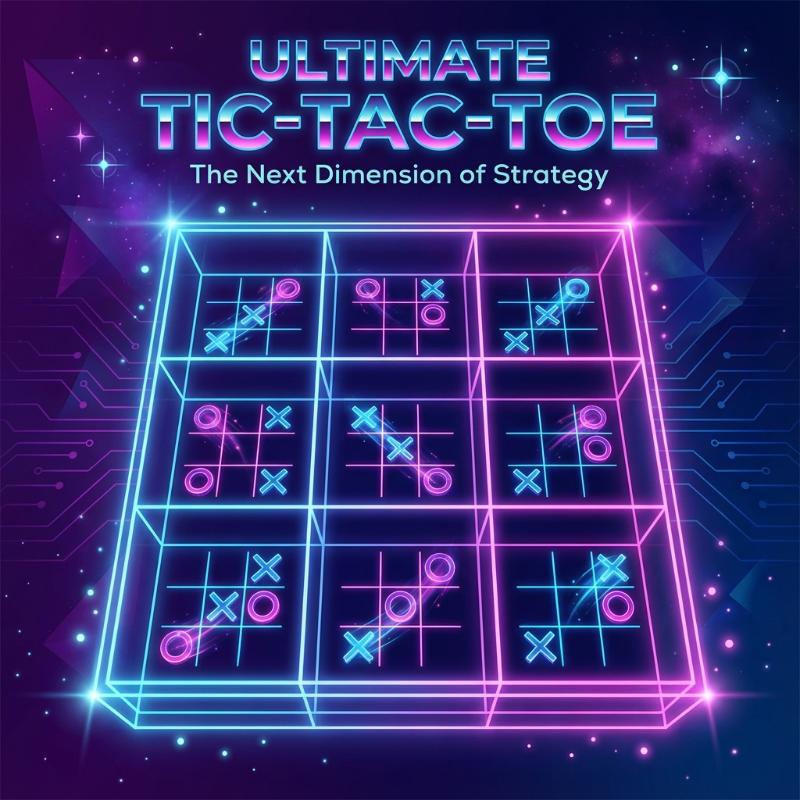

# 🎮 Ultimate Tic-Tac-Toe

Um Jogo da Velha 2.0 com tabuleiros aninhados, IA inteligente e modo tempo!

## 🕹️ Como Jogar

- **Tabuleiro:** 9 mini jogos da velha formando 1 grande
- **Regra chave:** A posição onde você joga determina onde o adversário deve jogar
- **Vitória:** Ganhe 3 mini-tabuleiros em linha para vencer!

## ✨ Funcionalidades

### Modos de Jogo
- 👥 **2 Jogadores** - Jogue localmente com um amigo
- 🤖 **vs Computador** - Jogue contra a IA

### Modo Tempo (2 Jogadores)
- ⏱️ Timer que acelera a cada turno
- 🎲 Jogada aleatória automática quando o tempo acaba

### Níveis de IA
- 😊 Fácil
- 🤔 Médio  
- 😈 Difícil

## 🚀 Jogar

Acesse: [Link do jogo após deploy]

## 📱 Compatível com Mobile

O jogo funciona perfeitamente em dispositivos móveis!

## 🛠️ Tecnologias

- HTML5
- CSS3 (Dark Mode, Animações, Glassmorphism)
- JavaScript (Vanilla)
